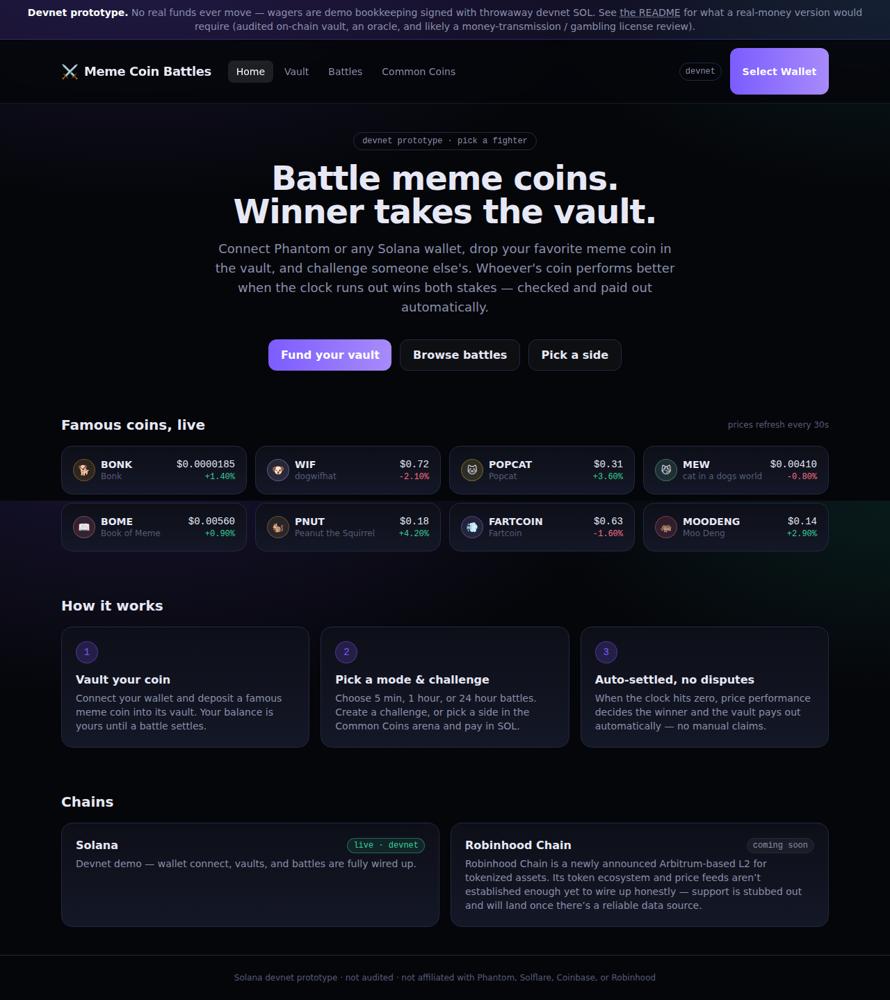

# Meme Coin Battles

Battle Solana meme coins head-to-head: whoever's coin performs better over
a fixed window wins both stakes, checked and paid out automatically. Connect
Phantom (or any Wallet Standard wallet), drop a famous meme coin in its
vault, then either challenge a specific coin or pick a side in the always-on
Common Coins arena and pay with SOL.



## Status: devnet prototype, not a real-money product

**No real funds ever move.** This was built to demonstrate the product and
the on-chain design, not to hold anyone's money. Specifically:

- The frontend runs against Solana **devnet** only, and every wallet action
  (deposit, challenge, stake) asks you to sign a real, free, inspectable
  devnet transaction — but the actual coin/SOL balances are demo bookkeeping
  in your browser's `localStorage`, not a real token vault. See
  `src/lib/tx.ts` and `src/lib/vault.ts`.
- The real vault/escrow design exists as a written-but-undeployed Anchor
  program in `/program`, and the automatic-settlement keeper exists as a
  written-but-unrun script in `/keeper`. Both are meant to be read as the
  production design, reviewed, tested, and deployed before anything here
  touches real value.
- Turning this into a real-money product is a different undertaking than a
  demo, and not just technically: escrowing other people's crypto and paying
  out a "winner" is a form of wagering, which typically means a security
  audit of the vault program at minimum, and — depending on your
  jurisdiction — money-transmission licensing and/or gambling regulation
  review before launch. None of that is done here.

## What's in this demo

- **Famous coins, live prices** — BONK, WIF, POPCAT, MEW, BOME, PNUT,
  FARTCOIN, MOODENG, priced from CoinGecko's public API and refreshed every
  30s.
- **Vault** — connect a wallet and deposit a coin (or SOL) into your vault
  before you can stake it anywhere.
- **Battles** — challenge a specific opponent coin: pick your coin, their
  coin, a wager amount, and a mode (5 min / 1 hour / 24 hour). Whoever
  accepts locks the same amount of their coin; when the clock runs out,
  whichever coin gained more (%) wins both stakes. Unanswered challenges can
  be reclaimed after the join window (shown as "starts in X minutes" while
  it's open, then a short "battle starts in X" once matched).
- **Common Coins** — four fixed matchups (BONK vs WIF, POPCAT vs MEW, BOME
  vs PNUT, FARTCOIN vs MOODENG) running continuously in all three modes.
  Pick a side and stake SOL; the side that's ahead is capped until the other
  side catches up, so both pools stay equal at every moment — no separate
  matching step needed.
- **Chains** — Solana is live (devnet). Robinhood Chain is listed as
  "coming soon": it's a newly announced tokenized-assets L2 without an
  established token ecosystem or price-feed source yet, so it's honestly
  stubbed out rather than faked.

## Architecture

```
solana-meme-coin-battles/
  src/            React + TypeScript + Tailwind frontend (Vite)
  program/        Anchor (Rust) vault/battle escrow program — written, not deployed
  keeper/         Node keeper that would auto-settle battles on-chain — written, not run
  docs/           README assets
```

The frontend is the only piece you can actually run end-to-end today. It
simulates what `/program` + `/keeper` would do once deployed: "vault"
balances live in `localStorage`, and a `setInterval` in the Battles and
Common Coins pages plays the keeper's role of checking for ended
rounds/battles and settling them against live prices. Each of `/program` and
`/keeper` has its own README explaining exactly what's built, what's
verified (both type-check against real dependencies), and what's left before
either could run for real — read those before extending this into something
that touches real funds.

## Running the frontend

```bash
npm install
npm run dev       # http://localhost:5173
```

Connect a Solana wallet (Phantom, Solflare, Coinbase Wallet, Trust Wallet,
or anything else implementing the Wallet Standard) and switch it to
**Devnet**. If you need devnet SOL for transaction fees, use the "Airdrop 1
SOL" button on the Vault page (devnet's public faucet is often
rate-limited — faucet.solana.com is the fallback).

```bash
npm run build      # production build
npm run preview    # serve the build locally
```

## Design notes worth knowing

- **Prices** come from CoinGecko's public API client-side; it's rate-limited
  and occasionally unavailable, so there's a static fallback price table
  (`src/lib/prices.ts`) to keep the UI populated.
- **Battle/round math** lives in `src/lib/battles.ts` and `src/lib/duels.ts`
  as pure functions, independent of React, so the on-chain program's logic
  (see `program/programs/battle_vault/src/lib.rs`) can be checked against
  the same rules.
- **Meme coins don't exist on devnet** (BONK, WIF, etc. are mainnet-only
  mints), which is why deposits are demo bookkeeping backed by a signed
  memo transaction rather than a real SPL transfer — there's no devnet token
  to actually move. SOL itself is real on devnet, so a production version
  could make the Common Coins SOL stakes real transfers well before the
  full token-vault program is deployed.
